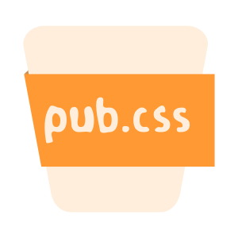

[](https://open.vscode.dev/hz2/pub.css)
[](https://github.com/hz2/pub.css/actions/workflows/action.yml)
[](https://www.npmjs.com/package/pub.css)
[](https://www.npmjs.com/package/pub.css)
[](https://github.com/hz2/pub.css/actions/workflows/action-docker.yml)
[](https://hub.docker.com/r/hzsq/pub.css)
 
 


A simple CSS style toolkit that helps you build pages easily

# Logo:



# Useage：

- For Less

```less
@import '~pub.css/less/index.less';
```

- For Scss

```scss
@import '~pub.css/scss/index.scss';
```

- css bundle

```scss
@import '~pub.css/css/index.css';
```

- main.js

```js
import 'pub.css/css/index.css';
```

- docker
start a service
```bash
docker run --name some-pubcss -d -p 8012:80 hzsq/pub.css
```
proxy `localhost:8012` as `/pubcss`
```html
<link rel="stylesheet" type="text/css" href="/pubcss/css/index.css">
```

# Document

- [Document](./doc.md)
